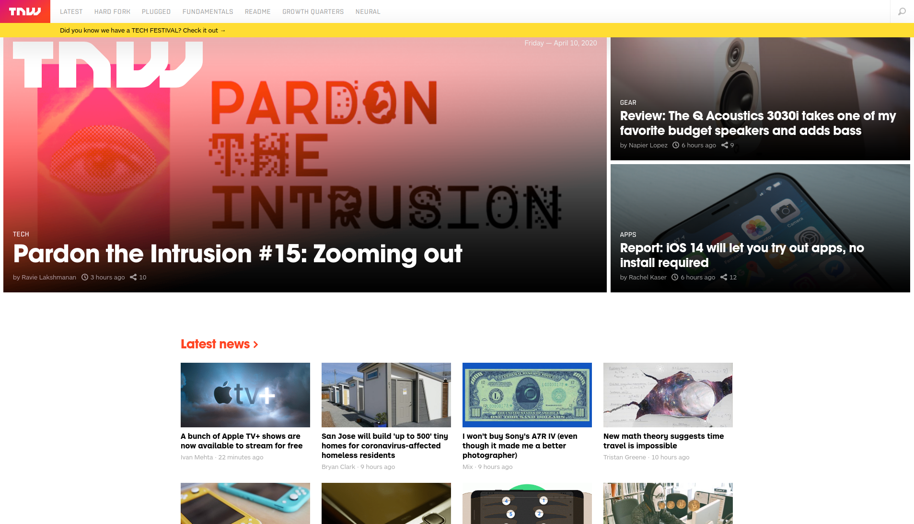

# Building with responsive design

> We’ll be cloning The Next Web, a tech-focused magazine which uses media queries to gracefully degrade their site as the window size is reduced.

This project consists of replicating the The Next Web website putting emphasis on how it behaves differently depending on the size of the screen where the website is rendered.

## Built With

- HTML 5,
- CSS 3,
- @Media queries.

## Live Demo

[Live Demo Link](https://meltrust.github.io/Building-with-Responsive-Design/)

## Getting Started

**To get a local copy up and running follow these simple example steps.**

- Clone the project unto your local machine
- Navigate into `index.html` file and run on the browser

## Future Features:

- Implement responsive design.

## Authors

👤 **Miguel Tapia**

- Github: [@meltrust](https://github.com/meltrust)
- Linkedin: [meltrust](https://www.linkedin.com/in/meltrust/)
- Contact me: original.mtapia@outlook.com

👤 **Smith Nkereuwem**

- Github: [@SmithVyne](https://github.com/SmithVyne)
- Linkedin: [smithvyne](https://www.linkedin.com/in/smithvyne/)

## 🤝 Contributing

Contributions, issues and feature requests are welcome!

Feel free to check the [issues page](issues/).

## Show your support

Give a ⭐️ if you like this project!

## Acknowledgments

- Hat tip to anyone whose code was used
- Inspiration
- etc

## 📝 License

This project is [MIT](lic.url) licensed.
